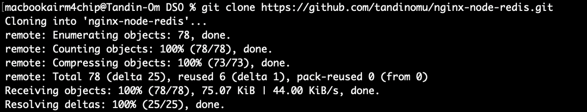
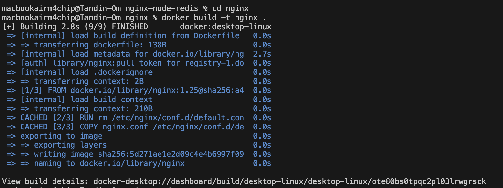
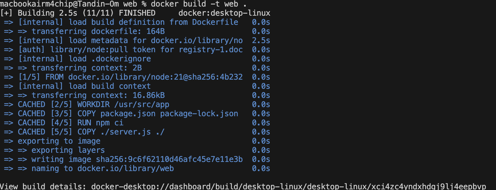
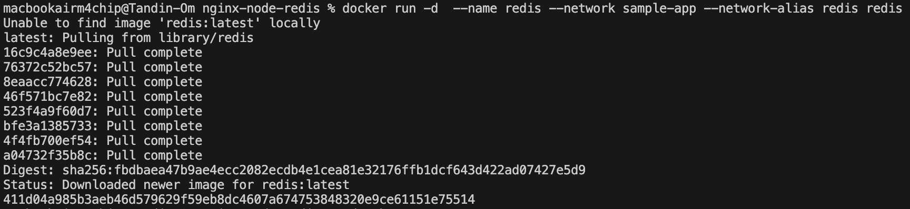
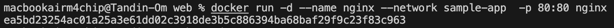
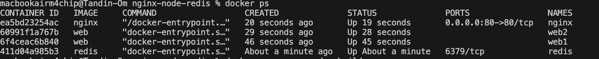
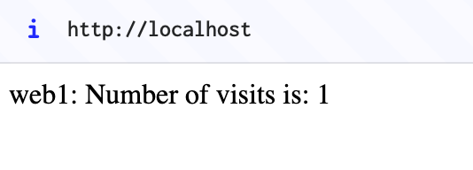
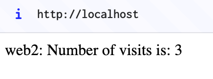
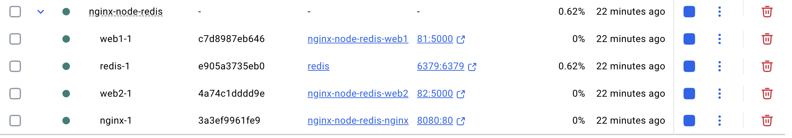

# Docker Networking and Container Communication

## Practical 2: Running Multi-Container Applications

This practical demonstrates how to run multiple containers and enable communication between them using Docker Compose, as an alternative to individual docker run commands.

## Overview

Using  `docker run` works well when we only need one container. But when there is a need of several containers that work together, it gets complicated and mistakes happen easily. In this practical, I learned:

- How to start multiple containers one by one using docker run
- How to set up a network so containers can talk to each other
- How to use Docker Compose to make everything simpler with just one command

## Exercise Steps

### Setting Up the Application

The exercise uses a sample counter web application consisting of:
- Node.js backend (web containers)
- Nginx reverse proxy
- Redis database for storing the counter value

To set up:

# Clone the repository

### Building the Images

Build the Nginx image:

Build the web image:

### Creating a Network

Before running the containers, create a network for them to communicate through:

### Running Containers with Docker Run

Start the Redis container:

Start the first web container:

Start the second web container:

Start the Nginx container:

### Verifying Container Communication

Verify that all containers are running:

Accessed the application in a browser at http://localhost and refresh several times to see load balancing between web1 and web2:

Verify that all containers are running through Docker Desktop Dashboard:

## Key Takeaways

- Container Networking: Docker allows containers to communicate through user-defined networks, enabling complex multi-container applications.

- Network Aliases: Each container can have a network alias which serves as a DNS name, making it easy for containers to find each other by name rather than IP address.

- Docker Compose Advantages:One file manages multiple containers, making setup and scaling easier.

- Nginx as Reverse Proxy: Nginx splits traffic between multiple web servers.

- Container Isolation: Each container performs a single function (web server, database, proxy) 

- Service Discovery: Containers use service names to connect, no IPs needed.